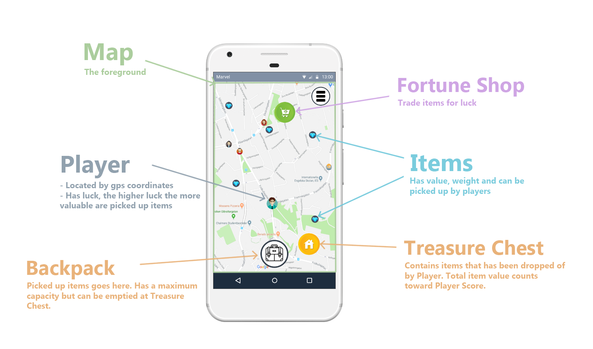
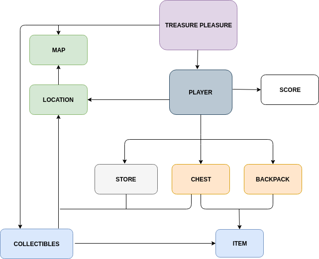

## 1 Introduction

#### Purpose of the application:
Excitement! Adventure! Treasure! This app will turn your dreary everyday stroll into an exciting adventure! The adventurous user is plunged into an exciting world where treasure is never far away. But be vigilant, else other shady characters may snatch your price from under your nose. Will you be the most famous adventurer in the land, achieving wealth and glory beyond imagination? Only the boldest user should apply. 

Encourage physical activity through an competitive and enjoyable gaming experience.

#### Who will it benefit:
Extraordinary gentlemen of exquisite taste. We believe the game can benefit anyone who enjoys a casual gaming experience while at the same time being outdoors. However the game will maybe mostly benefit those who aren't very physically active in their day to day life because of lack of motivation.

#### General description:
TreasurePleasure is a competitive mobile multiplayer game for Android devices. It will use the users phone GPS to locate him/her on a shared **map** where multiple **players** compete with each other by collecting the most **items**.

Each **player** has a **backpack** with a maximum capacity, when the capacity is full the backpack must be emptied at the players **chest** before more things can be collected. Whoever has the most value contained in their **chest** at the end of a **season** wins that season and will appear on the **score**.

#### In what situations can the application be used?
The application can be used to encourage a group of people to become more active by adding some flavour to their physical activity. It can also be used more casually by anyone who want to explore and compete within a virtual reality in their spare time.

### 1.1 Wordlist

- The **Map** is the main view of the game. We append the players location on a map served by google. From the map a player can interact with items, stores and settings

- A **Player** is one of several players on a map. Players are unique to each user. Players also hold a backpack and a treasure chest, where they can store items collected from different locations on the map.

- **Collectables** are randomly spawned items on the map. Collectables can be interacted with by players, and collected if the player is close enough to the collectable. These items are shared for all players so the one that picks an item up first gets it, and the collectable is removed from the global map. There is always a certain amount of collectables available, when one is collected a new collectable is randomly spawned.

- A **Item** is a valueble in the game. There are different items and each item has a value and a unique type/id. The type can for example be diamond, stone and gold.

- A **Backpack** is a local inventory that every player carries with them. Backpacks are unique to each player and can only carry a limited amount of items in them. When a players backpack is full the player has to empty it to his/hers tresure chest.

- A **Treasure Chest** is stationary storage unit with unlimited size. A player has one unique treasure chest that the player choses where to place when first starting the game. When a player empty his/hers backpack into the treasure chest a total value is calculated and dispalyed.

- A **Avatar** is an image representing the player. A player has the oppurtunity to chose his avatar in game.

- A **Store** is a way for the player to buy a higher value multiplier. The value multiplier increases the value of collected items from the map.

- A **Score** is a players unique player score for the current season. The score is calculated using collected items value after the player has inserted them to his/hers treasure chest. 

- **Season** is a limited duration that a player can collect items and increments his/hers score. The season is a global season for all players. The player with the highest indivdual score after a season has ended won.

- A **Drop Bonus**: Players experienced in the art of finding valuable collectables can achieve a drop bonus. Drop bonus increases the value of items found.

- A **Location**: is real world location, represented by coordinates in latitude and longitude.

- A **Collect**: is an event where a Player picks up Collectable on the Map and puts in his or her backpack. 

#### Future implementations
- **Settings** - Here one can access the highscore or change name and avatar.
- **Hall of Fame** - A list or high score of the best performing players.

## 2 Requirements

### 2.1 Epics / User Stories

**1.1 As a player I want to see a map pinpointing my location so that I get a sense of belonging in the game**

    A map should show a representation of the real world (streets, buildings and locations)
    Map is constrained to specific area
    
**1.2 As a player, I want objects to have a location; so that I know where to find them.**

    Add location to Chest
    Add location to Upgrade Center
    Add hashmap with <item,location> in TreasurePleasure model
    
**1.3. As a player I want to see different items on the map so that I know what I can collect**

    There is always a certain amount of items on the map
    Items are spread out rather than clustered
    Items has value and type
    There are at least 3 items differing in appearance and value

**2.1 As a player, I want to a backpack so that I can collect items and plan my walk.**
    
    The backpack holds an iteger representing maximum capacity (number of items).
    Backpack has slots accordiing to capacity.
    The backpack must display the contents
    Backpack has a function to erase all items when called

**2.2 As a player, I want to be able to pickup items that I'm near; because items are valuable to me.**

    Have a function that can compare two distances
    The item must be within reaching distance for the player to pick it up
    Cannot add item to full backpack
    If item is added to backpack, it must be removed from the map
    if item is not added to backpack, it must remain on the map
    When an item is removed from the map a new item appears
    
 **2.3 As a player, I want a storage chest, with unlimited capacity, to unload my backpack contents into. - So that I can save all my valuables**
    
    Chest has unlimited capacity
    The chest can display the value of contained items
    There must be a certain distance between the chest and the upgrade center
    The player must be close to the chest to be able to use it
    After function call: all items that were in the backpack must be in the chest.
    The player should be notified somehow that the backpack has been emptied.
    
**3.1 As a player, I want to be able to improve my character with drop-bonuses. This will add a sense of progress to my game experience.**

    Player has a attribute dropBonus.
    When a collectable is picked up its value is multiplied and changed according to the dropBonus    
    
**3.2 As a player, I want to be able to visit a Store, where I can spend items (or item value) in exchange for bonuses.**
    
    There must be a certain distance between the chest and the upgrade center
    The store appears on the map
    When close enough player can interact with store
    Ability to choose items from backpack and trade them for drop bonus (e.g. dropbonus increases by 1/100*(value of item))
  
  
**4.1 As a player I need a player class so that I can get a backpack, chest and upgrade center.**

    Implement a class Player holding a Backpack, Chest and Upgrade Center
    All calls on functions in Backpack, Chest and Upgrade Center goes through Player
    
**4.2 As a player I want to have a choosable nick and an avatar so that I get a personalized experience**
    
    Can choose nick and avatar on first time playing game
    Player cannot take already taken nick
    Can change nick and avatar when in game
    Information about current nick and avatar is available

### Not yet implemented

**5.1 As a new player I want the game to have seasons with certain duration so that a winner is determined and everything resets and gives equal opportunities to all.**

    Implement a Class Season
    Season has an attribute integer or Date that defines the length or end of a season

**5.2 As a player I want to be able to see my and others current score to see how well I'm doing.**
    
    Implement function returning the 5 players (in order) with highest value in their chest. (highscore)
    
**5.3 As a player I want to see the history of who has won previous season in case I am on that scoreboard.**

    Implement function returning the current leader of the season (winner)

### 2.2 User interface

The main view is a map where various objects are displayed. The user of the application can interact with these objects if they are close enough, if not then they have to move to get closer to them. If e.g. a player is close enough to an item that is on the map the user can click on this item to collect it. The user can also interact with his or her chest and store, where items can be dropped of or traded for increased drop rate.

## 3 Domain model

### 3.1 Class responsibilites
Each class has responsibilites. Below follows a short descripition of the different classes in the domain model.

- Treasure Pleasure: is the hub of the model. Handles and redirects information. Collaborates with Player, Location, Backpack and Collectables to handle Collects. Stores user name and handles name update. In addition it keeps track of players.

- Player: keeps track of player related properties. A player has a username, an avatar, a chest, a drop bonus. 

- Real World Location: Collectibles, Treasure Chest and Player have coordinates in the real world. In the app, players and collectibles are represented as icons on a map. As the user walks around in the real world, his coordinates are updated accordingly. Handles logic to check if a player is close enough to an item to collect it.

- Collectables: is responsible for keeping track of Location for items populating the game. Can spawn new randomized items and assign the item a random location. 

- Backpack: is responsible to keep track of any items currently carried by a player. A backpack has room for a limited number of items. A backpack can be improved to hold more items.

- Chest: keeps track of current score. Has a Location.

- Item: keeps track of Item type and value.

- Store: provides a place for a player to improve Drop Bonus. Has a Location. Yet to be implemented.

- Score: not in use. Is currently represented by a variable in Chest.

- Season: responsible for handling Season. Yet to be implemented.
